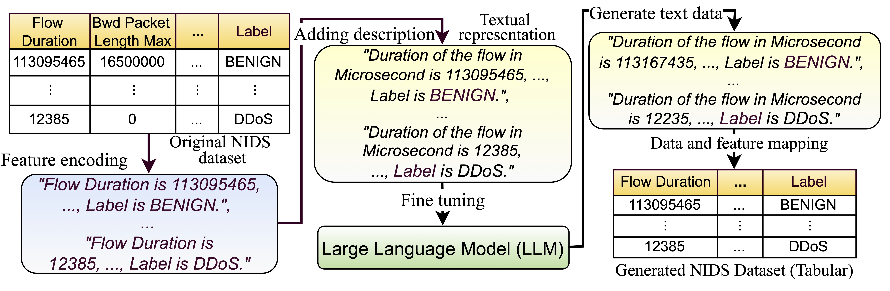

# GReaT Framework



---
## Dataset
You can download the processed dataset from [here](https://eltnmsu-my.sharepoint.com/:f:/g/personal/hcao_nmsu_edu/Etuw1nXMxgZAixSU405NdEkBsNo8AVsR2X41lfv1gDD4yA?e=Aec8dD).

---

## Pre-trained Large Language Model

You can download the original pre-trained LLM from [GPT-Neo-125m](https://huggingface.co/EleutherAI/gpt-neo-125m/tree/main), you can find more pre-trained model from [HuggingFace](https://huggingface.co/).

You also can download the fine-tuned LLM from our [OneDrive](https://eltnmsu-my.sharepoint.com/:f:/g/personal/hcao_nmsu_edu/EhTZWB27vSJLi1zSXNeQDlcBXBusi7XVo41Rjo3SC0brVQ?e=MPnxrB).

---

## Install be_great library:
```aiignore
pip install be-great
```
Requires a `Python version >= 3.9`. If you have problem to set up environment for conda from the linux server, you can get help from [here](https://github.com/JiefeiLiu/Federated_learning_env_set_up). 

You can find the original GReaT framework from [here](https://github.com/tabularis-ai/be_great).

## Quick start for fine-tuning and generating
1. Download the processed [data](https://eltnmsu-my.sharepoint.com/:f:/g/personal/hcao_nmsu_edu/Etuw1nXMxgZAixSU405NdEkBsNo8AVsR2X41lfv1gDD4yA?e=1fG78t), and put then into the [data](https://github.com/gongwolf/NID-GPT/tree/main/data) directory. 
2. (optional) The sample [code](https://github.com/gongwolf/NID-GPT/blob/main/data_process/CICIDS2017_change_column_names1.ipynb) to replace the feature names to full explanation of the CICIDS2017 dataset.
3. Sample command to fine-tune the LLM and generate the synthetic data for CICIDS2017 dataset shows below:

```aiignore
python generate_great_data.py --epochs 10 --batch_size 8 --n_samples 50000 --device cuda

```
#### Parameters:
- epochs: Total epochs to fine-tune the LLM, each epoch takes more than a month to train. 
- batch_size: A subset of the training dataset used in one iteration of training, if GPU memory is small, suggest use smaller batch size like 1 or 2. 
- n_samples: Target number of instances for the synthetic data.
- device: use cpu or GPU, default GPU: "cuda". 


### Other Parameters
You need to change the data paths from the following optional arguments for the experiments of the other datasets. 
```aiignore
optional arguments:
  -h, --help            show this help message and exit
  --llm LLM             HuggingFace checkpoint of a pretrained large language model used as the base model.
  --experiment_dir EXPERIMENT_DIR
                        Directory where the training checkpoints will be saved.
  --batch_size BATCH_SIZE
                        Batch size used for fine-tuning.
  --epochs EPOCHS       Number of epochs to fine-tune the model.
  --save_steps SAVE_STEPS
                        Save the model after this many steps.
  --n_samples N_SAMPLES
                        Number of synthetic samples to generate.
  --k K                 Sampling batch size. Higher values speed up the generation process.
  --max_length MAX_LENGTH
                        Maximum number of tokens to generate. Ensure it's long enough to not cut off any information.
  --start_col START_COL
                        Feature to use as the starting point for the generation process.
  --start_col_dist START_COL_DIST
                        Distribution of the starting feature (as a Python dictionary string).
  --device DEVICE       Device to use for generation (e.g., 'cuda' or 'cpu').
  --data_path {../data/CICIDS2017/train_all_classes.csv,../data/CICDDOS2019/training.csv,../data/UNSW/train_all_classes.csv}
                        Path to the training CSV data.
  --save_model_path SAVE_MODEL_PATH
                        Path to save the trained model.
  --output_csv OUTPUT_CSV
                        Path to save the generated synthetic data as CSV.
```

## Quick start for loading fine-tuned model and generating
1. Download the fine-tuned [LLMs](https://eltnmsu-my.sharepoint.com/:f:/g/personal/hcao_nmsu_edu/EhTZWB27vSJLi1zSXNeQDlcBXBusi7XVo41Rjo3SC0brVQ?e=MPnxrB). Put the folder into current file directory.
2. Run the following command 

```aiignore
python generate_samples.py --n_samples 10000 --output_csv synthetic_10k.csv --device cuda
```
- n_samples: Target number of instances for the synthetic data.
- output_csv: output CSV file name.
- device: use cpu or GPU, default GPU: "cuda". 

### Other Parameters
```aiignore

optional arguments:
  -h, --help            show this help message and exit
  --model_dir MODEL_DIR
                        Path to the directory of the fine-tuned GReaT model.
  --n_samples N_SAMPLES
                        Number of synthetic samples to generate.
  --k K                 Sampling batch size. Higher values speed up the generation process.
  --max_length MAX_LENGTH
                        Maximum number of tokens to generate. Ensure it's long enough to not cut off any information.
  --start_col START_COL
                        Feature to use as the starting point for the generation process.
  --start_col_dist START_COL_DIST
                        Distribution of the starting feature (as a Python dictionary string).
  --device DEVICE       Device to use for generation (e.g., 'cuda' or 'cpu').
  --output_csv OUTPUT_CSV
                        Path to save the generated synthetic data as CSV.
```


## Generated data
You can find the generated synthetic sample [data](https://eltnmsu-my.sharepoint.com/:f:/g/personal/hcao_nmsu_edu/EsWIEZ2UkjVEhriVpG3kvWwB80r-NyopUve1A7MaOmmGaA?e=omE0Rv) generated by CTGAN, TabDDPM and GReaT for UNSW-NB15, CICIDS2017 and CICDDoS2019.
