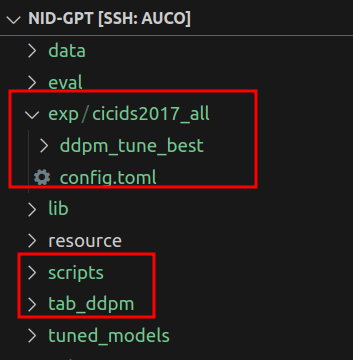
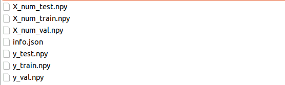
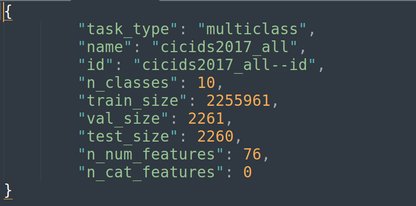
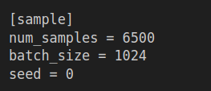
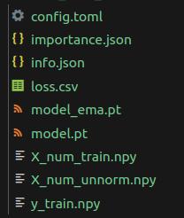
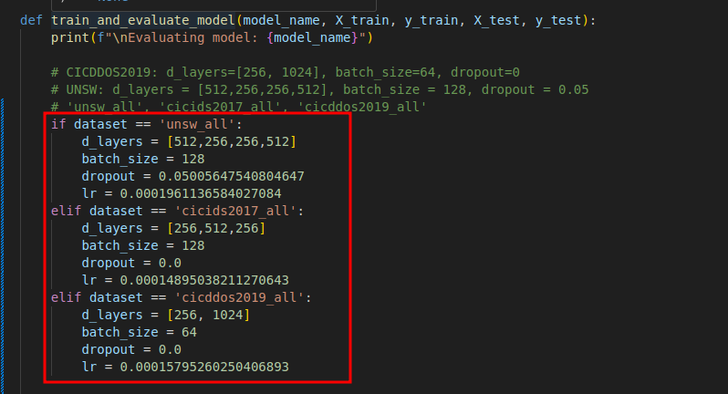

# NID-GPT

## Installation
Add the root of this folder to the ```PYTHONPATH``` variable.
```
export PYTHONPATH={path/to/project}/NID-GPT:$PYTHONPATH
```

## Project Structure 

## Methods

### 1. CTGAN
Run the script to train a GAN model and sample from the trained model.  
```
python scripts/ctgan_train_generation.py --help
usage: ctgan_train_generation.py [-h] [--input INPUT] --metadata METADATA [--model_path MODEL_PATH] [--output OUTPUT] [--epochs EPOCHS] [--num_rows NUM_ROWS] [--use_cuda] [--table_name TABLE_NAME]
                                 [--sample_only]

Train and save a CTGAN model with synthetic data generation.

optional arguments:
  -h, --help            show this help message and exit
  --input INPUT         Path to the input data file (CSV format).
  --metadata METADATA   Path to save the CTGAN metadata JSON file.
  --model_path MODEL_PATH
                        Path to save the trained CTGAN model file.
  --output OUTPUT       Path to save the generated synthetic data (CSV format).
  --epochs EPOCHS       Number of training epochs for CTGAN.
  --num_rows NUM_ROWS   Number of synthetic rows to generate.
  --use_cuda            Flag to enable CUDA (GPU) support if available.
  --table_name TABLE_NAME
                        the table name showed in the metafile
  --sample_only         If only do the sampling
  --load_meta_only      If only read the meta file instead of creating a new one
```

Command to train and sample:
```
python scripts/ctgan_train_generation.py --input /data/qgong/data/CICIDS2017/cicids_all_train_dataset.csv --output /data/qgong/data/CICIDS2017/ctgan_synthetic_data_all_v1.csv --meta /data/qgong/data/CICIDS2017/ctgan_data_all_metadata.json --model /data/qgong/data/CICIDS2017/all_ctgan_synthesizer_v1.pkl --num_rows 10 --epochs 5 --use_cuda
```

Sample only based on trained GAN model, need to add the ```--sample_only``` parameters. 
```
python scripts/ctgan_train_generation.py --output /data/qgong/data/CICIDS2017/ctgan_synthetic_data_all_v1.csv --meta /data/qgong/data/CICIDS2017/ctgan_data_all_metadata.json --model /data/qgong/data/CICIDS2017/all_ctgan_synthesizer.pkl --num_rows 200000 --sample_only --use_cuda
```

### 2. TAB_DDPM

#### 2.1 preperation 
1. Create a folder named "exp" in the same level of "scripts" and "tab_ddpm". Then create your own folder for your dataset. **Strongly recoomand use "exp" as the name, since some configurations in the code of tab_ddpm use it, especially if you want to run the tune hyperparameter scripts.**



2. create your dataset folder. In the folder, split data into train, test, and val partitions, then store in npy type. 



Also, create a ```info.json``` file, adjust it based your datasets. **Notice:In our processed data, all features are numerical and the number should no include the label colum. It shoud be equal to the shape of X_num_train.npy.**



3. Create a ```config.toml``` file under the ```exp/{your_dataset_name}/```. In the toml file, 
```
- parent_dir is the folder where to storage trained model, generated samples. 
- read_data_path is the folder where storges the dataset for trainning the diffusion model. 
- model_params are number of class labels, and if y label exsits. In our case, it's number of attacking types and true, respectively. 
- model_params.rtdl_params defines the architecture of the MLP model used in the diffusion model. 
- diffusion model parameters: number of steps for nosing and denosing, the loss function.  
- training parameters to train the diffusion model. 
```


Also, parameters related to sampling:




#### 2.2 Execute the script:
```
python scripts/pipeline.py --config [path_to_your_config] --train --sample 
python scripts/pipeline.py --config exp/cicids2017_all/config.toml --train --sample
```
All results, including trained models, sampled datas will be in the same folder as the "parent_dir" in your ```config.toml```.



**NOTICE:** If hyperparameters are tuned followed step 3, the best config is stored in ```~/NID-GPT/exp/{dataset}/ddpm_tune_best/config.toml```, you can copy it back to ```~/NID-GPT/exp/{dataset}```. At the same time, **MAKE SURE the parameters, such as parent_dir, real_data_path, num_samples, are correct.**


### 3. Hyperparameters tuning:
#### 3.1 MLP
This mlp is the model used for final evaluting the generated/sampled synthetic data (**NOT the mlp metioned in the ```config.tmol```**).

The final parameters are stored in ```~/NID-GPT/tuned_models/mlp_{dataset}.json```.


```
python eval/tune_eval_mlp.py --help
usage: tune_eval_mlp.py [-h] [--ds_name DS_NAME] [--device DEVICE] --train TRAIN --test TEST

optional arguments:
  -h, --help         show this help message and exit
  --ds_name DS_NAME  dataset name used to create a json file to store configuration of the MLP model under ~/tuned_models
  --device DEVICE    device used to train the model, cuda, cuda:1, or cpu
  --train TRAIN      Path to the training CSV file
  --test TEST        Path to the testing CSV file
```
```
python eval/tune_eval_mlp.py --train /data/qgong/data/CICIDS2017/cicids_all_train_dataset.csv --test /data/qgong/data/CICIDS2017/cicids_all_test_dataset.csv --ds_name cicids2017_all --device cuda:2
```

#### 3.2 TAB_DDPM
Basd on the tuned parameters of the MLP mentioned in 3.1, we could tune the parameters of the diffusion model by executing the tune_ddpm script. 

```
python scripts/tune_ddpm.py --help
usage: tune_ddpm.py [-h] [--eval_seeds] --test TEST ds_name train_size eval_type eval_model prefix

positional arguments:
  ds_name 
  train_size
  eval_type
  eval_model
  prefix

optional arguments:
  -h, --help    show this help message and exit
  --eval_seeds
  --test TEST   Path to the testing CSV file
```
```
python scripts/tune_ddpm.py cicids2017_all 6500 synthetic catboost ddpm_tune --test /data/qgong/data/CICIDS2017/cicids_all_test_dataset.csv
```

The best config.toml, trained model and sampled data will store in the ```exp/${ds_name}/${prefix}_best``` folder. 

#### NOTICE: ${ds_name} should be same for trainning diffusion model, tune hyperparamters of diffusion and MLP. 

### 4. Evalution 

Before the evaluation, make sure the **parameters of MLP** are set correctly in ```~/NID-GPT/scripts/evaluation.py```. It may come from the fine-tuned MLP (step 3.1), where the final parameters are stored in ```~/NID-GPT/tuned_models/mlp_{dataset}.json```. Also you can set it mannually. 



```
python scripts/evaluation.py --help
usage: evaluation.py [-h] --train TRAIN --test TEST --model {logistic_regression,decision_tree,random_forest,svc,mlp}

Evaluate different ML models

optional arguments:
  -h, --help            show this help message and exit
  --train TRAIN         Path to the training CSV file
  --test TEST           Path to the testing CSV file
  --model               {logistic_regression,decision_tree,random_forest,svc,mlp},Name of the model to evaluate
  --dataset             Name of the dataset
```

```
python scripts/evaluation.py --train /data/qgong/data/CICIDS2017/results/ddpm_synthetic_data_all.csv --test /data/qgong/data/CICIDS2017/test_all_classes.csv --model mlp --dataset cicids2017_all
```

### 5. Auxiliary Functions
- ```~/data_process/transfer_csv_to_npy.ipynb```: Transfer a single csv file to npy files that are used to train or fine-tuned parameters of diffusion models. 
- ```~/data_process/transfer_npy_to_csv.ipynb```: Transfer sampled npy files by the trained diffusion model to CSV, which is used to do the final evaluation.  
- ```~/data_process/feature_distribution.ipynb```: Draw figures of the distributions of values of columns between orginal data and synthetic data. 
