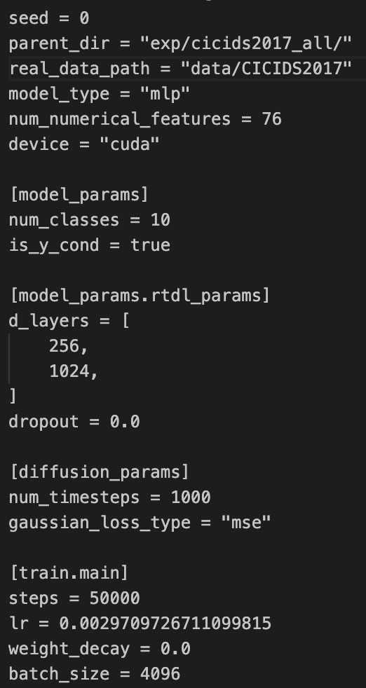

# Is Synthetic Data from Generative Models Ready for Network Intrusion Detection Systems?


<h3 align="center">
Jiefei Liu, Qixu Gong, Wenbin Jiang, Pratyay Kumar, Abu Saleh Md Tayeen, Huiping Cao, Satyajayant Misra, Jayashree Harikumar
</h3>

<h3 align="center">
MILCOM 2025 (Accepted and Presented)
</h3>

<h4 align="center">
[Link to Paper - coming soon]
</h4>


This repository contains the official resources for the paper "Is Synthetic Data from Generative Models Ready for Network Intrusion Detection Systems?", which evaluates the use of generative AI for creating synthetic datasets for network intrusion detection.

---
[//]: # (## 📖 Publication)

[//]: # ()
[//]: # (The associated paper, "Is Synthetic Data from Generative Models Ready for Network Intrusion Detection Systems?", was accepted and presented by Jiefei Liu on October 6, 2025, at MILCOM 2025 in Los Angeles, CA, USA.)


[//]: # (## ✍️ Authors and Contributors)

[//]: # ()
[//]: # (We would like to thank all the authors and contributors for their help in completing this work:)

[//]: # ()
[//]: # (- Jiefei Liu)

[//]: # (- Qixu Gong)

[//]: # (- Wenbin Jiang)

[//]: # (- Pratyay Kumar)

[//]: # (- Abu Saleh Md Tayeen )

[//]: # (- Huiping Cao)

[//]: # (- Satyajayant Misra)

[//]: # (- Jayashree Harikumar)

[//]: # (## 1. Getting Started)

This section provides instructions for setting up the environment and project.

## 1. 🚀Environment Setting

To run the code in this codebase, you need to set up **two** environments.

One environment is used to run CTGAN and TabDDPM. The second environment is used to run GReaT(LLM). 

**important!!!** This two environments are not compitable with each other. Please straight follow the instruction below:

[//]: # (Follow these steps to create the conda environment and install the required packages. If you need help to set up environment on the Linux Server, click [here]&#40;https://github.com/JiefeiLiu/Federated_learning_env_set_up&#41;.)

[//]: # ()
[//]: # (Due to the incompatible requirement python packages between TabDDPM and GReaT&#40;LLM&#41;, you need to set up **two** conda environments for CTGAN, TabDDPM and GReaT&#40;LLM&#41;.   )


1. Create and use environment for CTGAN and TabDDPM: <br>
    Create and activate conda environment:
    ```aiignore
    conda create -n nidgpt1 python=3.9 
    conda activate nidgpt1
    ```
    Install dependencies: 
    ```aiignore
    pip install -r requirements1.txt
    ```


[//]: # (    ```bash)

[//]: # (    conda create -n nidgpt1 python=3.9 )

[//]: # (    conda activate nidgpt1)

[//]: # (    pip install -r requirements1.txt)

[//]: # (    export PYTHONPATH={path/to/project}/NID-GPT:$PYTHONPATH)

[//]: # (    ```)


[//]: # (    ```bash)

[//]: # (    pip install -r requirements1.txt)

[//]: # (    ```)
[//]: # (3.  Add the project root to your `PYTHONPATH`:)

[//]: # (    ```bash)

[//]: # (    export PYTHONPATH={path/to/project}/NID-GPT:$PYTHONPATH)

[//]: # (    ```)

2. Create and use environment for GReaT(LLM): <br> 
   Create and activate conda environment:
    ``` 
   conda create -n nidgpt2 python=3.9 
   conda activate nidgpt2
   ```
   Install dependencies: 
   ```
   pip install be-great
   ```

## 2. 🔬 Qick Start to Reproducing the Results Shown in the Paper

You can reproduce our findings in using the simple batch scripts by executing each step.

### 2.1 Using Batch Scripts for CTGAN and TabDDPM

The fastest way to reproduce our results is to use the provided bash scripts.

  0. **Download the processed [data](https://eltnmsu-my.sharepoint.com/:f:/g/personal/hcao_nmsu_edu/Etuw1nXMxgZAixSU405NdEkBsNo8AVsR2X41lfv1gDD4yA?e=cXsVl2) folder, and put it into the root directory.**

  1. Add the project root to your `PYTHONPATH`:
  ```
  export PYTHONPATH={path/to/project}/NID-GPT:$PYTHONPATH
  ```
  2. **Train CTGAN and sample synthetic data (conda environment:`nidgpt1`):**

    ./batch_scripts/ctgan.sh
    
  3. **Train Tab-DDPM and sample synthetic data (conda environment:`nidgpt1`):**

    ./batch_scripts/tab_ddpm.sh

  4. **Fine-tune [GReaT(LLM)](GReaT) and sample synthetic data (conda environment:`nidgpt2`):**
    
    ./batch_scripts/begreat.sh

  5. **Evaluate the generated data (conda environment:`nidgpt1`):**

    ./batch_scripts/eval.sh
    

### 2.2 Estimate running time for above bash files (better configuration might use less running time):
- Our Linux server configuration: CPU: AMD EPYC 7313, RAM:512 GB, GPU: NVIDIA A100. 
- CTGAN: ~3 weeks
- TabDDPM: ~1 day
- GReaT(LLM): ~4 months
- You can find the single run command for faster reproduce in Section: [Manual Reproduction](#4--manual-reproduction-detailed-steps).

**You can find all the experiment results from [here](results/README.md).**


## 3. Project Structure

A brief overview of the key directories in this repository.

```
NID-GPT/
├── batch_scripts/      # Pre-configured bash scripts to run experiments
├── data_process/       # Jupyter notebooks for data pre/post-processing
├── eval/               # Scripts for model evaluation and hyperparameter tuning
├── exp/                # Default directory for experiment configs and outputs (for Tab-DDPM)
├── GReaT/              # Code and resources for the LLM (GReaT) model
├── results/            # Directory containing all experiment results
├── resource/           # Images used in the README
├── scripts/            # Python scripts for training, sampling, and evaluation
├── tab_ddpm/           # Source code of the Tab-DDPM model
├── tuned_models/       # JSON files storing tuned MLP hyperparameters for evaluating and TAB_DDPM training
└── requirements.txt    # Python dependencies
```

---

## 4. ⚙️ Manual Reproduction (Detailed Steps)
This section provides a detailed breakdown of each step for manually running the data preparation, generation, tuning, and evaluation pipelines.


### Step 0: Data Preparation

Some models, like Tab-DDPM, require data to be in a specific `.npy` format.

  * To convert your `.csv` data into `.npy` files, see the `data_process/transfer_csv_to_npy.ipynb` notebook.
  * To convert generated `.npy` samples back to `.csv` for evaluation, see the `data_process/transfer_npy_to_csv.ipynb` notebook.

**You also can find the raw csv and our processed data [here](https://eltnmsu-my.sharepoint.com/:f:/r/personal/hcao_nmsu_edu/Documents/DATA/DAC_UH_Jiefei_Milcom2025wk_ICMLAext_CL/NID-GPT/data?csf=1&web=1&e=eY8iTm).**

-----


### Step 1: Generate Synthetic Data (Choose a Model)
#### 1.1 CTGAN

Run the script to train a GAN model and sample from the trained model.  
```
python scripts/ctgan_train_generation.py --help
usage: ctgan_train_generation.py [-h] [--input INPUT] --metadata METADATA [--model_path MODEL_PATH] [--output OUTPUT] [--epochs EPOCHS] [--num_rows NUM_ROWS] [--use_cuda] [--table_name TABLE_NAME]
                                 [--sample_only]

Train and save a CTGAN model with synthetic data generation.

optional arguments:
  -h, --help            show this help message and exit
  --input INPUT         Path to the input data file (CSV format).
  --metadata METADATA   Path to save the CTGAN metadata JSON file.
  --model_path MODEL_PATH
                        Path to save the trained CTGAN model file.
  --output OUTPUT       Path to save the generated synthetic data (CSV format).
  --epochs EPOCHS       Number of training epochs for CTGAN.
  --num_rows NUM_ROWS   Number of synthetic rows to generate.
  --use_cuda            Flag to enable CUDA (GPU) support if available.
  --table_name TABLE_NAME
                        the table name showed in the metafile
  --sample_only         If only do the sampling
  --load_meta_only      If only read the meta file instead of creating a new one
```

  * **Command to Train and Sample:**

    ```
    python scripts/ctgan_train_generation.py --input data/CICIDS2017/cicids_all_train_dataset.csv --output data/CICIDS2017/ctgan_synthetic_data_all_v1.csv --meta data/CICIDS2017/ctgan_data_all_metadata.json --model data/CICIDS2017/all_ctgan_synthesizer_v1.pkl --num_rows 10 --epochs 5 --use_cuda
    ```

  * **Command to Sample Only (from a trained model):**

    ```
    python scripts/ctgan_train_generation.py --output data/CICIDS2017/ctgan_synthetic_data_all_v1.csv --meta data/CICIDS2017/ctgan_data_all_metadata.json --model data/CICIDS2017/all_ctgan_synthesizer.pkl --num_rows 200000 --sample_only --use_cuda
    ```

#### 1.2 TAB\_DDPM
**1. Preparation**
1. Create a folder named "exp" in the same level of "scripts" and "tab_ddpm". Then create your own folder for your dataset. **Strongly recoomand use "exp" as the name, since some configurations in the code of tab_ddpm use it, especially if you want to run the tune hyperparameter scripts.**

<!--  -->
</img>


2. create your dataset folder. In the folder, split data into train, test, and val partitions, then store in npy type. 


Also, create a ```info.json``` file, adjust it based your datasets. **Notice:In our processed data, all features are numerical and the number should no include the label colum. It shoud be equal to the shape of X_num_train.npy.**

<!--  -->
</img>


1. Create a ```config.toml``` file under the ```exp/{your_dataset_name}/```. In the toml file, 
```
- parent_dir is the folder where to storage trained model, generated samples. 
- read_data_path is the folder where storges the dataset for trainning the diffusion model. 
- model_params are number of class labels, and if y label exsits. In our case, it's number of attacking types and true, respectively. 
- model_params.rtdl_params defines the architecture of the MLP model used in the diffusion model. 
- diffusion model parameters: number of steps for nosing and denosing, the loss function.  
- training parameters to train the diffusion model. 
```
<!--  -->
</img>

Also, parameters related to sampling:


**2. Execution**
```
python scripts/pipeline.py --config [path_to_your_config] --train --sample 
python scripts/pipeline.py --config exp/cicids2017_all/config.toml --train --sample
```
All results, including trained models, sampled datas will be in the same folder as the "parent_dir" in your ```config.toml```.


**NOTICE:** If hyperparameters are tuned followed step 3, the best config is stored in ```~/NID-GPT/exp/{dataset}/ddpm_tune_best/config.toml```, you can copy it back to ```~/NID-GPT/exp/{dataset}```. At the same time, **MAKE SURE the parameters, such as parent_dir, real_data_path, num_samples, are correct.**

#### 1.3 GReaT

Please see the [GReaT (LLM)](GReaT) directory for instructions on using this model.


-----

### Step 2: (Optional) Hyperparameter Tuning

#### 2.1 Tuning the Evaluation MLP
This mlp is the model used for final evaluting the generated/sampled synthetic data (**NOT the mlp metioned in the ```config.tmol```**).

The final parameters are stored in ```~/NID-GPT/tuned_models/mlp_{dataset}.json```.


```
python eval/tune_eval_mlp.py --help
usage: tune_eval_mlp.py [-h] [--ds_name DS_NAME] [--device DEVICE] --train TRAIN --test TEST

optional arguments:
  -h, --help         show this help message and exit
  --ds_name DS_NAME  dataset name used to create a json file to store configuration of the MLP model under ~/tuned_models
  --device DEVICE    device used to train the model, cuda, cuda:1, or cpu
  --train TRAIN      Path to the training CSV file
  --test TEST        Path to the testing CSV file
```
  * **Example Command:**
    ```bash
    python eval/tune_eval_mlp.py --train data/CICIDS2017/cicids_all_train_dataset.csv --test data/CICIDS2017/cicids_all_test_dataset.csv --ds_name cicids2017_all --device cuda:2
    ```

#### 2.2 Tuning Tab-DDPM

Basd on the tuned parameters of the MLP mentioned in 3.1, we could tune the parameters of the diffusion model by executing the tune_ddpm script. 

```
python scripts/tune_ddpm.py --help
usage: tune_ddpm.py [-h] [--eval_seeds] --test TEST ds_name train_size eval_type eval_model prefix

positional arguments:
  ds_name 
  train_size
  eval_type
  eval_model
  prefix

optional arguments:
  -h, --help    show this help message and exit
  --eval_seeds
  --test TEST   Path to the testing CSV file
```
  * **Example Command:**
    ```bash
    python scripts/tune_ddpm.py cicids2017_all 6500 synthetic catboost ddpm_tune --test data/CICIDS2017/cicids_all_test_dataset.csv
    ```

The best config.toml, trained model and sampled data will store in the ```exp/${ds_name}/${prefix}_best``` folder. 

**NOTICE:** Ensure you use the same `${ds_name}` (e.g., `cicids2017_all`) for all related tuning and training scripts.

### Step 3: Evaluate the Generated Data

Before the evaluation, make sure the **parameters of MLP** are set correctly in ```~/NID-GPT/scripts/evaluation.py```. It may come from the fine-tuned MLP (step 3.1), where the final parameters are stored in ```~/NID-GPT/tuned_models/mlp_{dataset}.json```. Also you can set it mannually. 


```
python scripts/evaluation.py --help
usage: evaluation.py [-h] --train TRAIN --test TEST --model {logistic_regression,decision_tree,random_forest,svc,mlp}

Evaluate different ML models

optional arguments:
  -h, --help            show this help message and exit
  --train TRAIN         Path to the training CSV file
  --test TEST           Path to the testing CSV file
  --model               {logistic_regression,decision_tree,random_forest,svc,mlp},Name of the model to evaluate
  --dataset             Name of the dataset
```

  * **Example Command:**

    ```bash
    python scripts/evaluation.py --train data/CICIDS2017/results/ddpm_synthetic_data_all.csv --test data/CICIDS2017/test_all_classes.csv --model mlp --dataset cicids2017_all
    ```

## 5. Auxiliary Functions
- ```~/data_process/transfer_csv_to_npy.ipynb```: Transfer a single csv file to npy files that are used to train or fine-tuned parameters of diffusion models. 
- ```~/data_process/transfer_npy_to_csv.ipynb```: Transfer sampled npy files by the trained diffusion model to CSV, which is used to do the final evaluation.  
- ```~/data_process/feature_distribution.ipynb```: Draw figures of the distributions of values of columns between orginal data and synthetic data. 

## 6. Sample Generated Synthetic Data
You can find the generated synthetic data from [here](https://eltnmsu-my.sharepoint.com/:f:/g/personal/hcao_nmsu_edu/EsWIEZ2UkjVEhriVpG3kvWwB80r-NyopUve1A7MaOmmGaA?e=omE0Rv).


## ✏️ How to Cite

If you use this work, please cite our paper:

*(BibTeX entry will be available here once the paper is published in the conference proceedings)*
