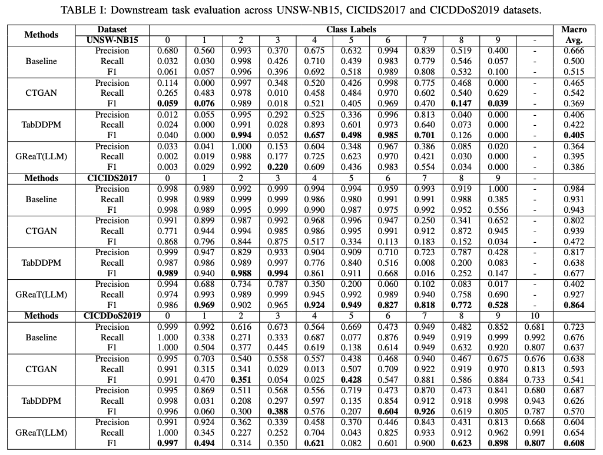
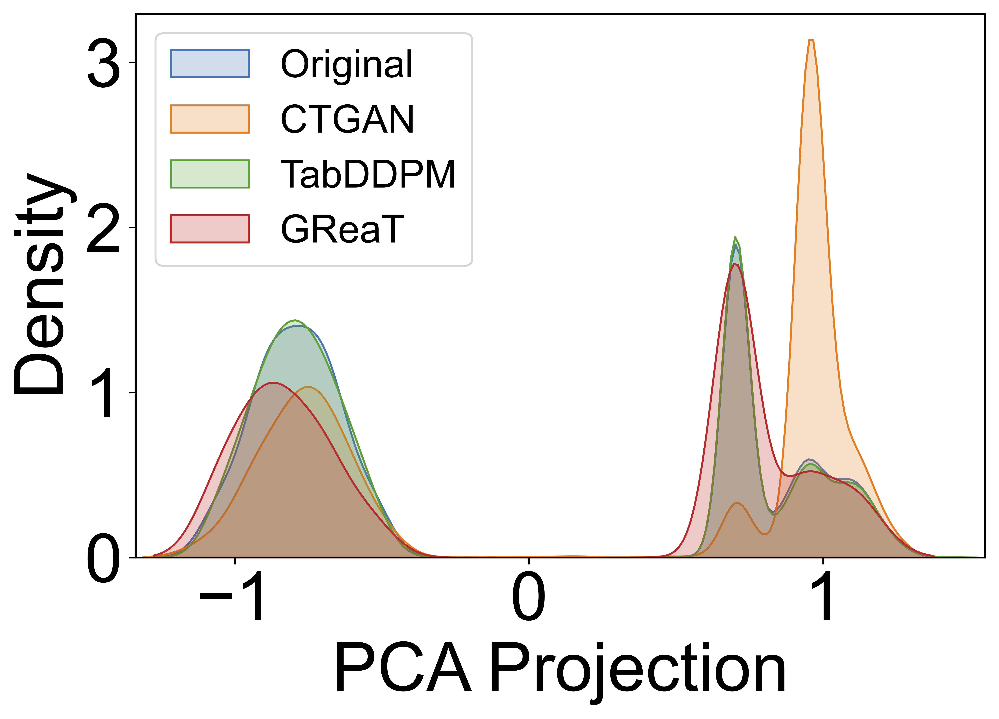
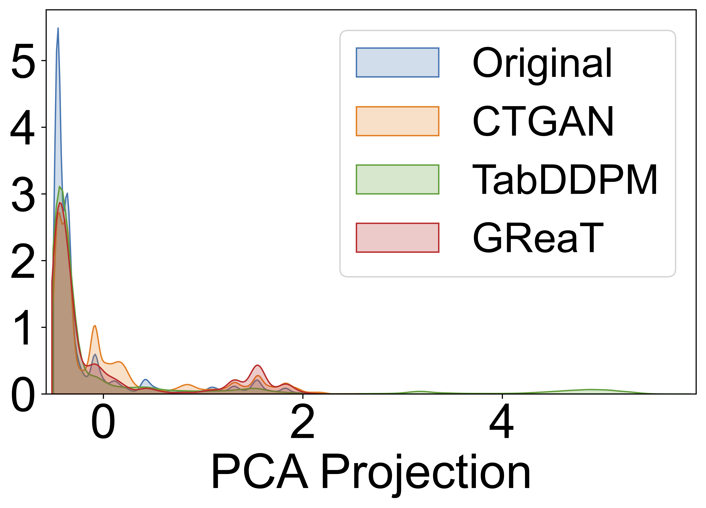
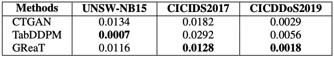

# All Experiment results 

## The data distribution of UNSW-NB15, CICIDS2017 and CICDDoS2019 datasets.
<table>
  <tr>
    <td align="center">
       
      <b>Figure 1.</b> UNSW data distribution 
    </td>
    <td align="center">
       
      <b>Figure 2.</b> CICIDS2017 data distribution 
    </td>
    <td align="center">
       
      <b>Figure 3.</b> CICDDoS2019 data distribution 
    </td>
  </tr>
</table>
We selected three widely used intrusion detection datasets: UNSW-NB15, CICIDS2017, and CICDDoS2019 for our experiments. Data preprocessing was performed following methodologies similar to those adopted in prior studies. To preserve as much relevant information as possible, we retained the majority of numerical features, resulting in 49, 77, and 78 features for UNSW-NB15, CICIDS2017, and CICDDoS2019, respectively. Given the large scale of CICDDoS2019 (millions of records), we randomly sampled 2,000,000 instances spanning 11 classes for our analysis, ensuring an equal number of instances for each attack class. The data distributions, number of features, and attack types for each dataset are summarized in Figures 1, 2, and 3. For each dataset, the generated data is equal in size to the original training data, and the class distribution in the synthetic data is preserved to match that of the original training set. As shown in Figures 1 and 2, the UNSW-NB15 and CICIDS2017 datasets contain 10 imbalanced  classes, reflecting the skewed class distributions typically observed in real-world internet traffic. The CICDDoS2019 dataset focuses on DDoS attacks and is inherently balanced, making it well-suited for classification tasks.

## Downstream Task Evaluation Across UNSW-NB15, CICIDS2017, and CICDDoS2019 Datasets

For the UNSW-NB15 dataset, the results in Table I show that all three generative models produced low-quality synthetic data. This is attributed to the extreme class imbalance in the dataset, particularly for the Analysis (Class 0), Backdoor (Class 1), Shellcode (Class 8), and Worms (Class 9) classes, as illustrated in Figure 4a. For example, MLPs trained on synthetic data from both TabDDPM and GReaT (LLM) achieved an F1-score of zero for the Worms class (Class 9), which has only 129 instances in the original training set. The MLP trained on CTGAN-generated synthetic data shows relatively better performance on minority classes such as Analysis and Backdoor, likely due to CTGAN’s adversarial training strategy and longer training duration. However, for majority classes in both the UNSW-NB15 and CICIDS2017 datasets, MLPs trained on TabDDPM-generated synthetic data achieved better classification performance. This suggests that TabDDPM is more effective at capturing data distributions when sufficient training samples are available.

## PCA density plots comparing the original dataset with three synthetic datasets generated by CTGAN, TabDDPM, and GReaT (LLM) across UNSW-NB15, CICIDS2017, and CICDDoS2019.
<table>
  <tr>
    <td align="center">
       
      <b>Figure 4.</b> UNSW-NB15 PCA density 
    </td>
    <td align="center">
       
      <b>Figure 5.</b> CICIDS2017 PCA density 
    </td>
    <td align="center">
       
      <b>Figure 6.</b> CICDDoS2019 PCA density 
    </td>
  </tr>
</table>

We compute their projected values along the first principal component (x-axis). We then calculate the probability density (y-axis) of each projected value and ensure that the area under the curve integrates to 1.
Figure 4 shows the density plot for the first PC for the UNSW-NB15 dataset, where the synthetic data generated by TabDDPM (shown in green) exhibits a closer overlap with the original data distribution (shown in blue). This visual observation aligns with our UNSW-NB15 dataset downstream evaluation results in Table I, where TabDDPM outperforms both CTGAN and GReaT (LLM) on the UNSW-NB15 dataset.

## First-order Wasserstein distance between original and generated samples (lower is better).

The first-order Wasserstein distances calculated between the original training data and the generated data by different generative AI methods are shown in Table II. For the UNSWNB15 dataset, TabDDPM-generated data exhibit the lowest Wasserstein distance to the original data, which is consistent with the highest macro F1 score from the MLP trained on TabDDPM-generated data (Table I). 
