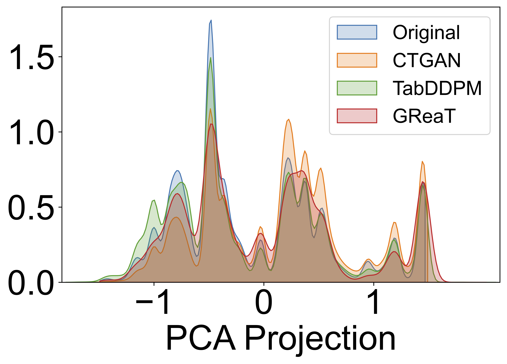

# Experiment results 

## The data distribution of UNSW-NB15, CICIDS2017 and CICDDoS2019 datasets.
<table>
  <tr>
    <td align="center">
       
      <b>Figure 1.</b> UNSW data distribution 
    </td>
    <td align="center">
       
      <b>Figure 2.</b> CICIDS2017 data distribution 
    </td>
    <td align="center">
       
      <b>Figure 3.</b> CICDDoS2019 data distribution 
    </td>
  </tr>
</table>

## Downstream Task Evaluation Across UNSW-NB15, CICIDS2017, and CICDDoS2019 Datasets

## PCA density plots comparing the original dataset with three synthetic datasets generated by CTGAN, TabDDPM, and GReaT (LLM) across UNSW-NB15, CICIDS2017, and CICDDoS2019.
<table>
  <tr>
    <td align="center">
       
      <b>Figure 1.</b> UNSW-NB15 PCA density 
    </td>
    <td align="center">
       
      <b>Figure 2.</b> CICIDS2017 PCA density 
    </td>
    <td align="center">
       
      <b>Figure 3.</b> CICDDoS2019 PCA density 
    </td>
  </tr>
</table>

## First-order Wasserstein distance between original and generated samples (lower is better).

